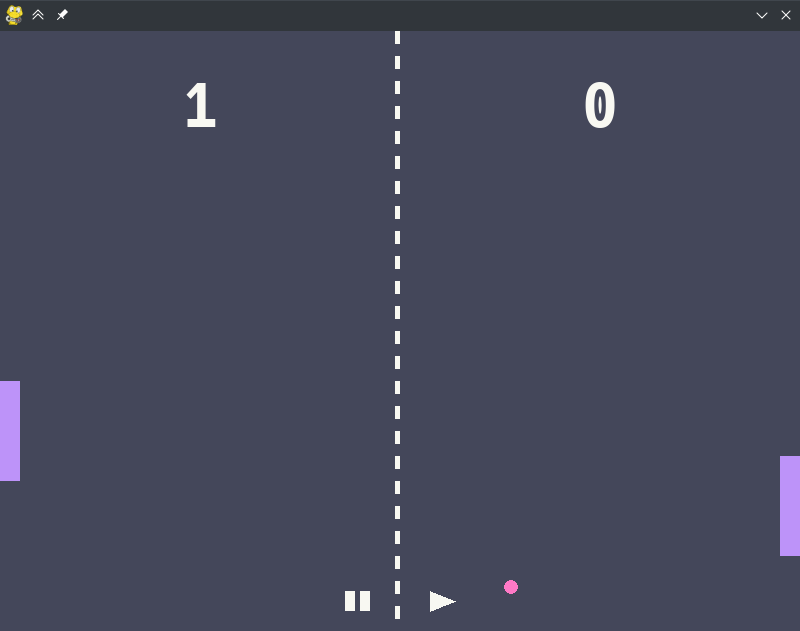

<div align="center" style="margin-bottom: 40px">
<h2 style="margin-bottom: 20px">Classic game of Pong with a few comfy additions</h2>

</div>

## About
A copy of the traditional [Pong](https://en.wikipedia.org/wiki/Pong) with local 1v1, simple defending AI & easily customizable colourschemes. Codebase is mostly OOP, so it's effortless and easy to fork or configure. Colourschemes are just estimations of the original ones, and thus might be a bit inaccurate.

## Resources
* [Hack](https://github.com/source-foundry/Hack)
* [pygame](https://pypi.org/project/pygame/)

## Setup & Usage
* Install the required libraries
    ```
    python3 -m pip install -r requirements.txt
    ```
* Command line arguments
    * -g \<num>: Select a gamemode (0: local 1v1*, 1: normal AI opponent, 2: AI vs AI)
    * -c \<name>: Select a colourscheme (default*, [dracula](https://draculatheme.com), [solarized](https://ethanschoonover.com/solarized/))
        ```
        # E.g.
        $ python3 src/main.py -g 1 -c dracula
        ```
    
